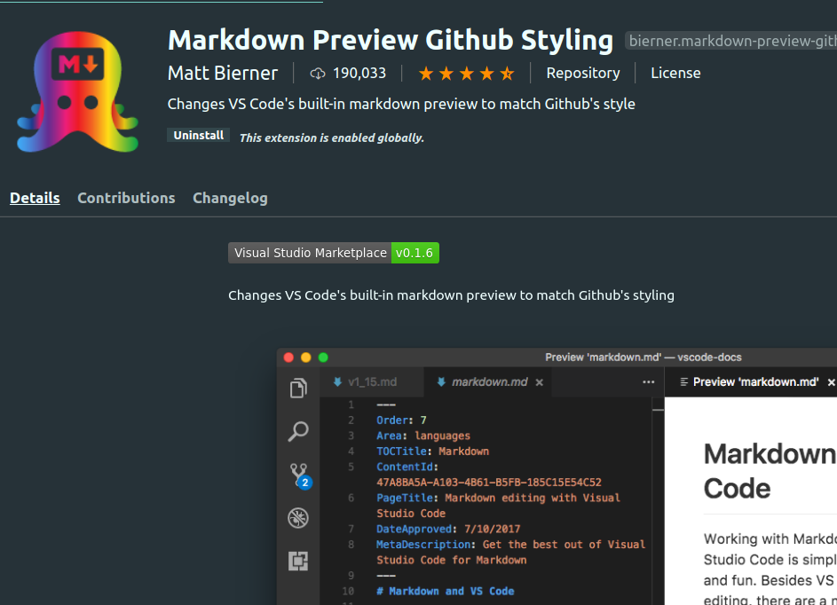

# <span style="color:green"> Readme <span>

---

##This repo is for covering tow ascpects of Readme text

### 1. [∞](./READEME.md) How to write a Markdown ?!

### 2. [∞](./AboutReadME.md) How to write an efficent Readme ?!

---

# <span style="color:green">What is the Markdown?!

The Markdown is a lightweight and easy-to-use syntax for styling all forms of writing on the GitHub platform.You control the display of the document; formatting words as bold or italic, adding images, and creating lists are just a few of the things we can do with Markdown. Mostly, Markdown is just regular text with a few non-alphabetic characters thrown in, like # or \*.

For more information, see [“Writing on GitHub”](https://help.github.com/en/github/writing-on-github) in the GitHub Help.

# <span style="color:green">Syntax guide:

---

- ## <span style="color:orange">Headers

```
#      This is an <h1> tag
##     This is an <h2> tag
###    This is an <h3> tag
####   This is an <h4> tag
#####  This is an <h5> tag
###### This is an <h6> tag
```

- ## <span style="color:orange">Emphasis
  - This is the _italic_ word by using one asterisks.
  - This is for the **Bold** word by using two asterisks.
  - **_All bold and italic_** by using three asterisks.

```
This is the *italic* word
This is for the **Bold**  word
***All bold and italic*** by using three asterisks

```

- ## <span style="color:orange">Lists

  #### <span style="color:#C46200">Unordered

- Item 1
- Item 2
  - Item 2a
  - Item 2b

```
* Item 1
* Item 2
  * Item 2a
  * Item 2b


```

### <span style="color:#C46200">Ordered

1. Item 1
1. Item 2
1. Item 3
   1. Item 3a
   1. Item 3b

```
1. Item 1
1. Item 2
1. Item 3
   1. Item 3a
   1. Item 3b


```

- ## <span style="color:orange">Images


<!--  -->

```
Format: 

```

- ## <span style="color:orange"> Links

http://github.com - automatic!
[GitHub](http://github.com)

```
http://github.com - automatic!
[GitHub](http://github.com)

```

- ## <span style="color:orange">Blockquotes

As Kanye West said:

> We're living the future so
> the present is our past.
> Inline code
> I think you should use an
> `<addr>` element here instead.

```
> We're living the future so
> the present is our past.
> Inline code
> I think you should use an
> `<addr>` element here instead.

```

- ## <span style="color:orange">Horizontal Rule

You can user Three or more...Make sure to make breaks with tow empty lines

---

<span style="color:#780000">Hyphens

---

<span style="color:#780000">Asterisks

---

<span style="color:#780000">Underscores

```
You can user Three or more...Make sure to make breaks with tow empty lines

---

Hyphens

***

Asterisks

___

Underscores

```

- ## <span style="color:orange">Syntax highlighting

```javascript
function fancyAlert(arg) {
  if (arg) {
    $.facebox({ div: '#foo' });
  }
}
```

````
        ```javascript
function fancyAlert(arg) {
  if(arg) {
    $.facebox({div:'#foo'})
  }
}```


````

- ## <span style="color:orange">Task Lists

- [x] @mentions, #refs, [links](), **formatting**, and <del>tags</del> supported
- [x] list syntax required (any unordered or ordered list supported)
- [x] this is a complete item
- [ ] this is an incomplete item

```
- [x] @mentions, #refs, [links](), **formatting**, and <del>tags</del> supported
- [x] list syntax required (any unordered or ordered list supported)
- [x] this is a complete item
- [ ] this is an incomplete item


```

- ## <span style="color:orange">Tables

You can create tables by assembling a list of words and dividing them with hyphens - (for the first row), and then separating each column with a pipe |:

| First Header                | Second Header                |
| --------------------------- | ---------------------------- |
| Content from cell 1         | Content from cell 2          |
| Content in the first column | Content in the second column |

would be like this :

```
| First Header                | Second Header                |
| --------------------------- | ---------------------------- |
| Content from cell 1         | Content from cell 2          |
| Content in the first column | Content in the second column |

```

- ## <span style="color:orange">Username @mentions

Typing an @ symbol, followed by a username, will notify that person to come and view the comment. This is called an “@mention”, because you’re mentioning the individual. You can also @mention teams within an organization.

<span style="color:#782300">Example : I will mention myself :smirk:
@karmelyoei

- ## <span style="color:orange">Strikethrough

Any word wrapped with two tildes (like ~~this~~) will appear crossed out.

```
(like ~~this~~)
```

- ## <span style="color:orange">Emoji :clown_face::clown_face:

GitHub supports emoji! :wink::smiley:

To see a list of every image we support, check out [the Emoji Cheat Sheet.](https://github.com/ikatyang/emoji-cheat-sheet/blob/master/README.md)

- ## <span style="color:orange">YouTube Videos

---

They can't be added directly but you can add an image with a link to the video like this:

```
<a href="http://www.youtube.com/watch?feature=player_embedded&v=YOUTUBE_VIDEO_ID_HERE
" target="_blank"></a>


```

Or, in pure Markdown, but losing the image sizing and border:

```
[](http://www.youtube.com/watch?v=YOUTUBE_VIDEO_ID_HERE)

```

- ## <span style="color:orange">Markdown Extensions Preview in VS

I use <span style="color:#C44B6B"> "Markdown Preview Github Styling" </span> you can find it in the extensions and apply it.



---

## <span style="color:green">Resources:

- https://guides.github.com/features/mastering-markdown/

- https://github.com/ikatyang/emoji-cheat-sheet/blob/master/README.md
